# AIR ACCIDENTS ANALYSIS PROJECT - PIDA
### MANUEL MARTINEZ MARGALEF

## Dashboard Link

## Overview
This project focuses on analyzing airplane accidents from 1908 to the present day. The primary objective is to gain insights into the trends, causes, and safety improvements in aviation over the years. The dataset used for this analysis, named 'air_accidents,' contains information about accidents, including date, location, operator, aircraft details, fatalities, and more.

In addition, I have conducted in-depth analyses of two key performance indicators (KPIs) to provide a comprehensive understanding of aviation safety:

1. **Crew Fatality Rate Reduction by 10% in the Last Decade:**
   - By analyzing this KPI, we found that the fatality rate reduction for crew between 2002 and 2011 was 3.18%, while the rate between 2012-2021 was 3.75%. This indicates that the fatality rate increased by 17.92% between the last decade and the previous one, which shows that the KPI measurements were not met.

2. **Reduction of Hijacking Incidents in Aviation Accidents by 10% the Last Decade:**
   - The analysis revealed that the hijacking rate in the total airplane accidents for the 2000s decade was 1.18%, mainly due to the 9/11 terrorist attacks. This contrasts highly with the 2010s decade in which the hijacking rate was 0%, which means the KPI measurements were met.

These KPIs provide valuable insights into specific aspects of aviation safety and contribute to a more comprehensive understanding of the data and its implications.
## Dataset
The 'Air_Accidents' dataset contains 5008 rows and includes the following columns:

* Date: Date of the accident
* DeclaredTime: Time of the accident
* Location: Location of the accident
* Operator: Airline/Military Delegation of the aircraft
* Route: Route taken by the airplane
* Aircraft: Plane model
* TotalOnBoard: Number of people on board
* PassengersAboard: Total passengers on board
* CrewAboard: Total Crew on board
* Fatalities: Number of lethal outcomes
* PassengerFatalities: Number of lethal outcomes (just passengers)
* CrewFatalities: Number of lethal outcomes (just crew)
* Ground: Total people killed due to crash on the ground (for example, those who were not on board, but died due to the crash)
* Summary: Brief summary of the case
* TotalFatalities: Sum of all the casualties
* Survived: Number of survivors
* SurvivalRate: Survival Rate
* IsMilitary: Military or non-military
* LocationCountry: Country extracted from Location

## Exploratory Data Analysis (EDA)
During the EDA phase, several visualizations and key performance indicators (KPIs) were developed:

1) Total Accidents per Year: Visualized the number of accidents over the years to identify any trends.

Total accidents per year from Non-Military flights.

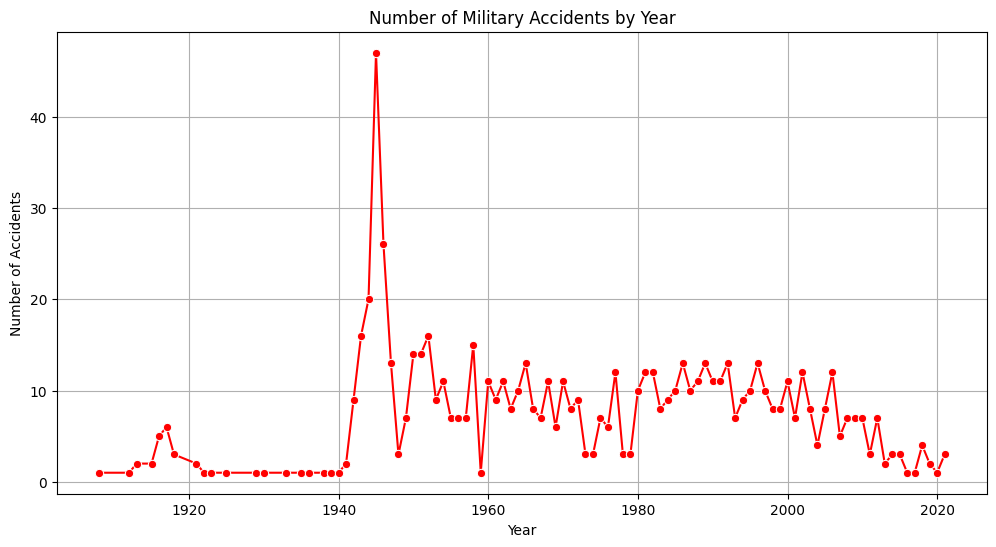
Total accidents per year from Military flights.

2) Fatalities per Year: Analyzed the fatalities in accidents to understand changes in aviation safety.

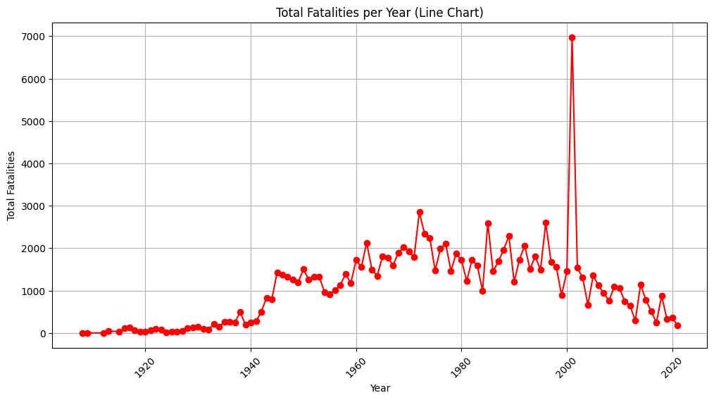

3) Distribution of Military vs. Non-Military Accidents: Examined the proportion of accidents involving military aircraft.

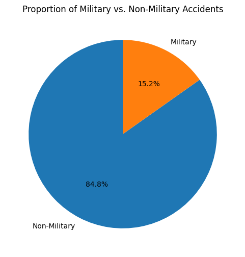

4) Operators with Most Accidents: Identified operators with the highest number of accidents.

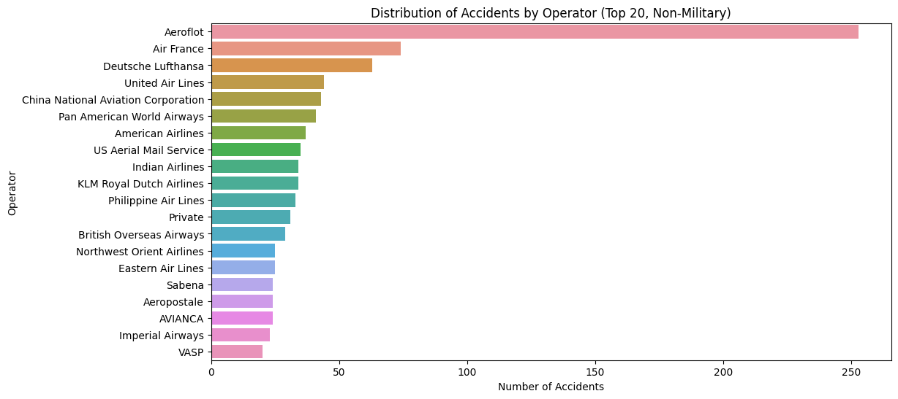

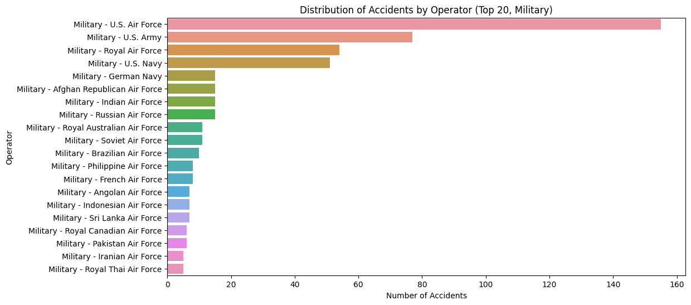

5) Countries with Most Accidents: Determined the countries where accidents were most frequent.

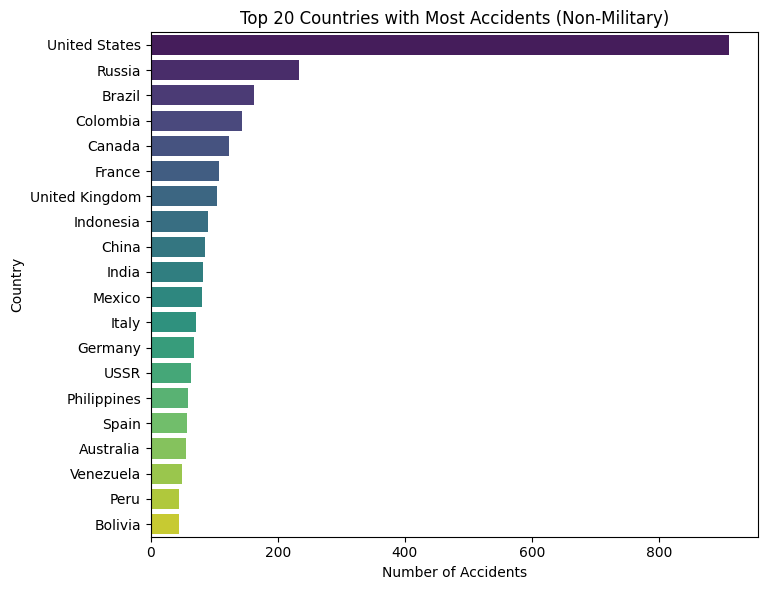
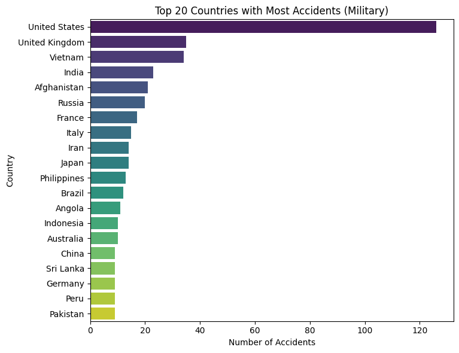

## Key Performance Indicators (KPIs)
### Crew Fatality Rate Reduction by 10% in the Last Decade

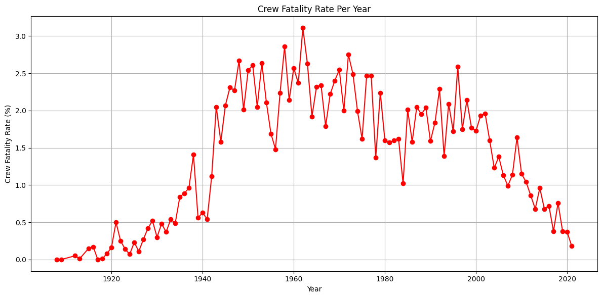

The analysis revealed that the crew fatality rate reduced by 3.18% between 2002 and 2011.

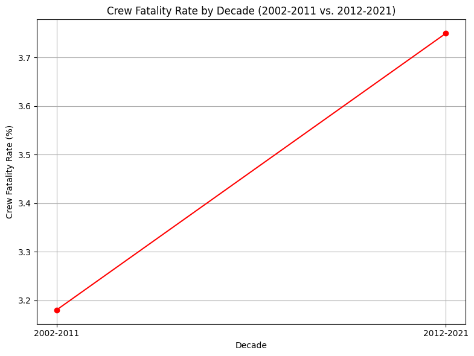

However, the rate increased by 3.75% between 2012 and 2021, resulting in a 17.92% increase over the last decade compared to the previous one. This indicates that the KPI was not met.
### Reduction of Hijacking Incidents in Aviation Accidents by 10% in the Last Decade

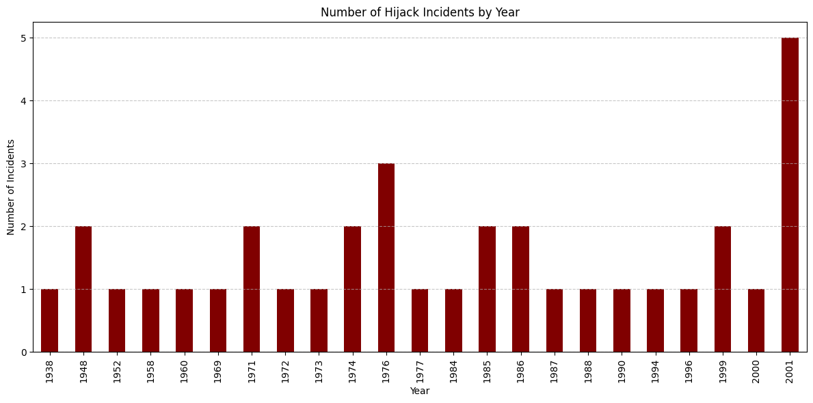

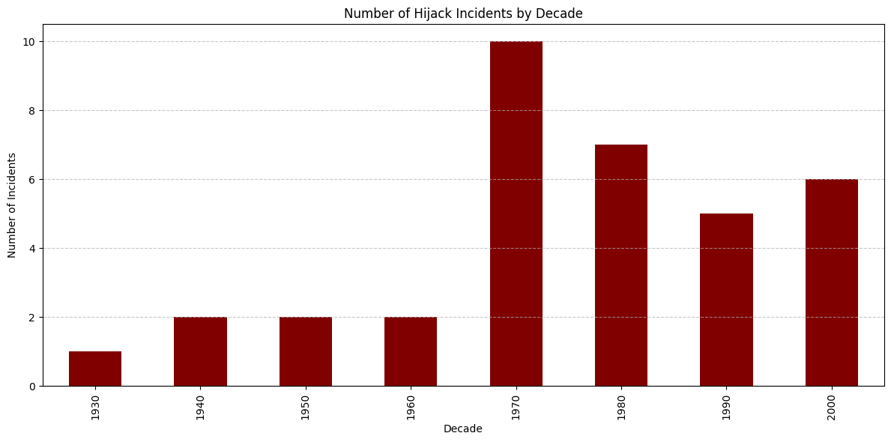

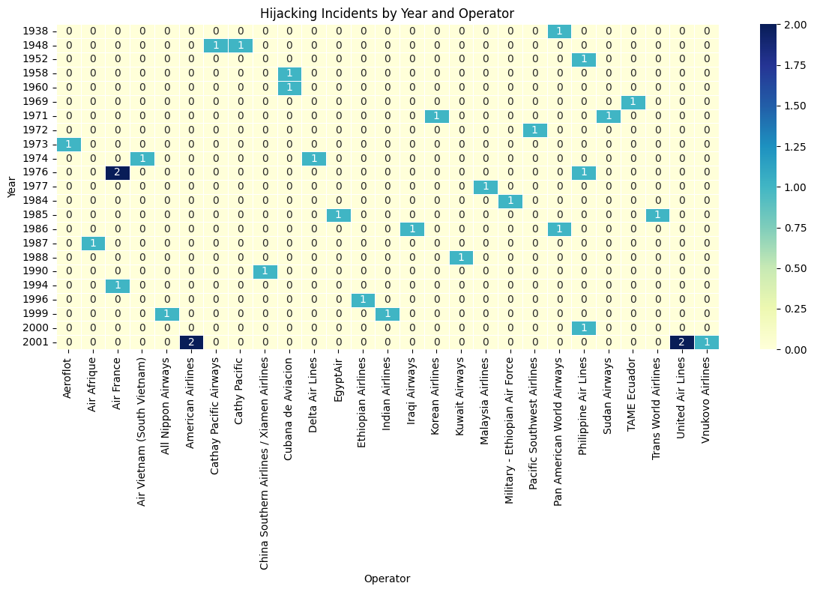

The hijacking rate in the total airplane accidents for the 2000s decade was 1.18%, primarily due to the 9/11 terrorist attacks.
Encouragingly, the hijacking rate dropped to 0% during the 2010s decade, meeting the KPI of reducing hijacking incidents by 10%.

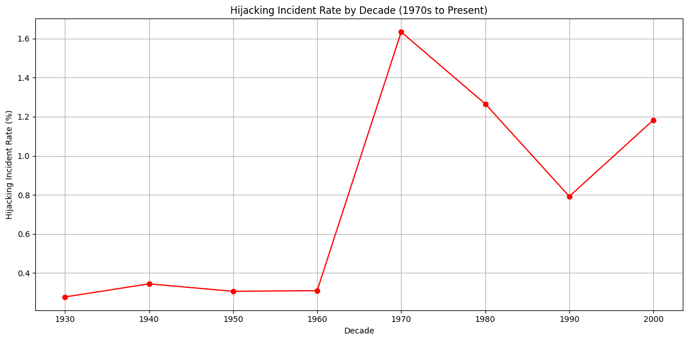

## Conclusion
This project provides valuable insights into the history of airplane accidents, with a focus on safety improvements and trends over the years. The analysis of KPIs demonstrates both successes and challenges in aviation safety, emphasizing the importance of continuous efforts to enhance crew safety and mitigate security threats.